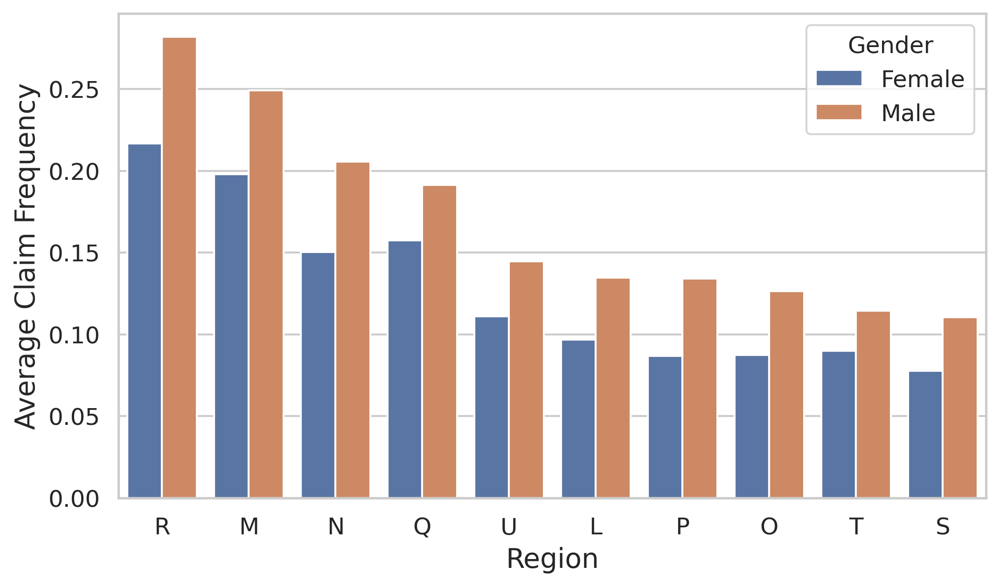
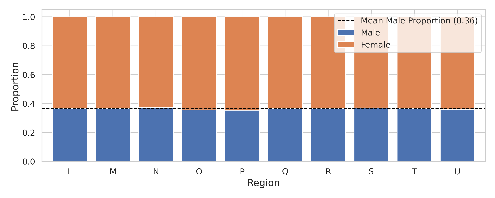
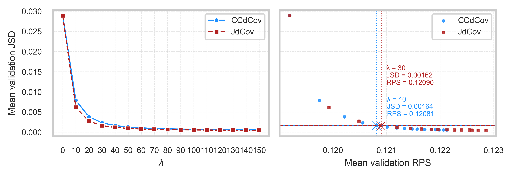
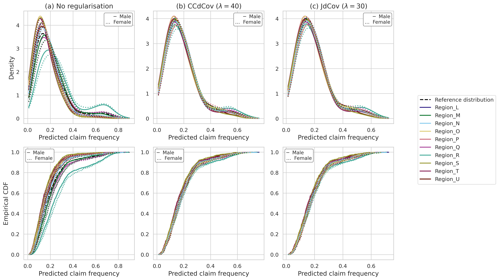
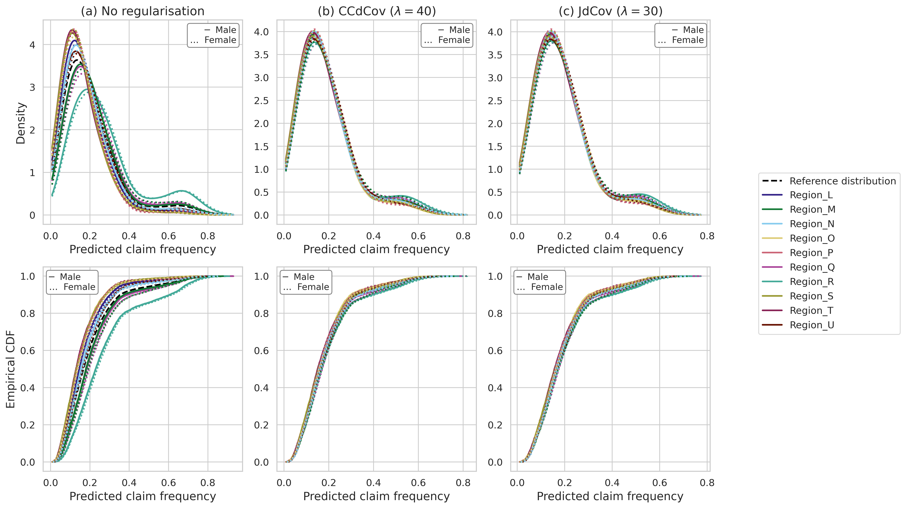

# pg15training_application
Ho Ming Lee, Katrien Antonio, Benjamin Avanzi, Lorenzo Marchi, Rui Zhou

- [Introduction](#introduction)
- [Preliminaries](#preliminaries)
  - [Loading required packages](#loading-required-packages)
  - [Loading data](#loading-data)
- [Exploratory data analysis](#exploratory-data-analysis)
- [Data splitting](#data-splitting)
- [Model calibration](#model-calibration)
  - [Hyperparameter tuning](#hyperparameter-tuning)
  - [$\lambda$ calibration](#lambda-calibration)
- [Model deployment](#model-deployment)
  - [Re-tuning hyperparameters](#re-tuning-hyperparameters)
  - [Model training](#model-training)
  - [Test results](#test-results)

# Introduction

We have employed another dataset, pg15training, a French motor insurance
dataset available in the R package `CASdatasets` by Dutang and
Charpentier (2024). The dataset consists of 100,000 policies covering up
to one year of exposure between 2009 and 2010. Each record corresponds
to an individual policyholder and includes attributes describing both
the insured and the vehicle. We model the number of third-party property
damage claims using Poisson regression, adjusting for exposure via the
variable `Expo`.

# Preliminaries

## Loading required packages

``` python
# Utility libraries
import pandas as pd
import numpy as np
import pyreadr
import seaborn as sns
import matplotlib.pyplot as plt
from multiprocessing import Pool
import pickle
import copy
from copy import deepcopy
import random
from pathlib import Path
from collections import defaultdict
import torch, math, multiprocessing as mp
from functools import partial

# torch related libraries for neural network architecture
import torch
import torch.nn as nn
import torch.nn.functional as F
import torch_optimizer as optimz
from torch.utils.data import DataLoader, TensorDataset, random_split

# sklearn libraries for data preprocessing and machine learning related functions
from sklearn.model_selection import StratifiedKFold, train_test_split, ParameterGrid
from sklearn.metrics import mean_poisson_deviance, make_scorer, log_loss
from sklearn.preprocessing import MinMaxScaler, OneHotEncoder, LabelEncoder
from sklearn.compose import ColumnTransformer
from sklearn.pipeline import Pipeline
from sklearn.neighbors import KernelDensity

# Package for sklearn with torch
from skorch import NeuralNetRegressor, NeuralNetClassifier
from skorch.callbacks import EarlyStopping
from skorch.helper import predefined_split
from skopt import gp_minimize
from skopt.space import Integer, Real, Categorical

# Scipy libraries for distributions and tests
from scipy.stats import poisson, wilcoxon, chi2_contingency, f_oneway, kruskal
from scipy.stats.distributions import chi2
```

``` python
# this is used to ignore warnings about limited subgroups when splitting the data into 5 folds through StratifiedKFold.
import warnings
warnings.filterwarnings("ignore", category=UserWarning)
```

``` python
# loading utility functions from /general
%run ../general/dcovs.py
%run ../general/dcovs_memeff.py
%run ../general/utils.py
%run ../general/metrics.py
%run ../general/NN.py
%run tune_pg15_parallel.py
```

## Loading data

``` python
df_pg15 = pyreadr.read_r('../data/pg15training.rda')
df_pg15 = df_pg15['pg15training']
```

# Exploratory data analysis

``` python
df_process = df_pg15.copy(deep=True)

df_process = df_process\
             .rename(columns={'Gender': 'Female', 'Group2': 'Region', 
                              'Poldur': 'Duration','Numtppd': 'nclaims',
                              'Type': 'CarType', 'Category': 'CarCat',
                              'Group1': 'CarGroup'})

df_process = df_process.iloc[21:] # removing duplicate observations
df_process.reset_index(inplace = True)
df_process = df_process.drop('rownames', axis=1) # Removing index column
df_process = df_process.drop(['Numtpbi', 'Indtppd', 'Indtpbi', 'PolNum',
                              'CalYear', 'SubGroup2', 'Adind'], axis = 1)
```

First, we examine the average claim frequency by region and gender.
Region R displays the highest average claim frequency for both genders,
and this pattern will be mirrored in the model’s predictions unless
mitigation is applied.

``` python
# Compute claim frequency
df_process['claim_freq'] = df_process['nclaims'] / (df_process['Exppdays'] / 365)

# Map 'Female' column to binary (0 = Male, 1 = Female) if it's stored as string
df_process['Female'] = df_process['Female'].map({'Male': 0, 'Female': 1})

# Sort region order by male average claim frequency (Female == 0)
male_avg = (
    df_process[df_process['Female'] == 0]
    .groupby('Region', observed=True)['claim_freq']
    .mean()
    .sort_values(ascending=False)
)

region_order = male_avg.index.tolist()

# Re-map back for legend clarity
df_process['Female'] = df_process['Female'].map({0: 'Male', 1: 'Female'})

# Plot
plt.figure(figsize=(8, 4.5))
sns.barplot(
    data=df_process,
    x='Region',
    y='claim_freq',
    hue='Female',
    order=region_order,
    errorbar=None
)

plt.xlabel("Region")
plt.ylabel("Average Claim Frequency")
plt.legend(title="Gender")
plt.savefig("figures/pg15eda.png", dpi=300, bbox_inches='tight')
plt.close()
```



Next, we look for the association between the protected attributes. In
this application, we treat Region and Female as the protected
attributes, and both of them are categorical. By applying the $\chi^2$
test for independence, we obtain a p-value of 0.5965 and we cannot
reject the null hypothesis that the two protected attributes are
independent.

``` python
counts = pd.crosstab(
    df_process['Region'],         # rows
    df_process['Female'],         # columns: 0 = Male, 1 = Female
)

# χ² test
chi2_stat, p_value, dof, expected = chi2_contingency(counts)
print(f"Chi-squared = {chi2_stat:.3f}   dof = {dof}   p-value = {p_value:.4g}")
```

    Chi-squared = 7.391   dof = 9   p-value = 0.5965

Here we also plotted out the proportion of male and female at each
region. The figure shows that the proportion of the two gender across
the regions are similar, With the above hypothesis test, we conclude
that the two protected attributes are empirically independent. In this
case, the use of JdCov should not bring any potential numerical
instability in our model.

``` python
# Row-wise proportions for the stacked bar
props = counts.div(counts.sum(axis=1), axis=0)      # normalise by row
props.columns = ['Male', 'Female']                  # nicer labels

# ────────────────────────────────────────────────
# 3.  Plot
# ────────────────────────────────────────────────
ax = props.plot(kind='bar', stacked=True,
                figsize=(10, 4), width=.8)

ax.set_xlabel("Region")
ax.set_ylabel("Proportion")
ax.legend(title="Gender", fontsize=9)
ax.tick_params(axis='x', rotation=0)

# horizontal line at the overall mean male proportion
mean_male = props['Male'].mean()
ax.axhline(mean_male, ls='--', c='black', lw=1.2,
           label=f"Mean Male Proportion ({mean_male:.2f})")

ax.legend()
plt.tight_layout()
plt.savefig("figures/pg15_eda2.png", dpi=300)
plt.close()
```



# Data splitting

The code chunks below will split the data into training and testing set
for model training.

``` python
df_process = df_process.drop(['claim_freq'], axis=1)
df_process['strat_key'] = df_process['nclaims'].astype(str) + '_' + df_process['Female'].astype(str) + '_' + df_process['Region'].astype(str)
```

``` python
np.random.seed(1220)
train_data, test_data = stratified_split_with_tolerance(df_process, 'strat_key', tolerance=0.0, test_size=0.2)
```

``` python
train_data['Exppdays'] = (train_data['Exppdays']/365)
train_data = train_data.rename(columns = {'Exppdays': 'Exposure'})
test_data['Exppdays'] = (test_data['Exppdays']/365)
test_data = test_data.rename(columns = {'Exppdays': 'Exposure'})


X_train = train_data
X_test = test_data
y_train = train_data['nclaims']
y_test = test_data['nclaims']
offset_train = train_data['Exposure']
offset_test = test_data['Exposure']

X_train['Female'] = pd.get_dummies(X_train["Female"])['Female'].astype(int)
X_test['Female'] = pd.get_dummies(X_test["Female"])['Female'].astype(int)

X_train['CarCat'] = X_train['CarCat']\
                    .cat.rename_categories({'Small':0, 'Medium':1, 'Large':2})
X_test['CarCat'] = X_test['CarCat']\
                   .cat.rename_categories({'Small':0, 'Medium':1, 'Large':2})

# Column names for different preprocessor
scale_col = ['Age', 'Bonus', 'Duration', 'Value', 'Density']
onehot_col = ['Region', 'CarType', 'Occupation','CarGroup']

# Setting up preprocessor for preprocessing the data
preprocessor = ColumnTransformer(
    transformers=[
        ('num', MinMaxScaler(feature_range=(0, 1)), scale_col),
        ('cat_onehot', OneHotEncoder(sparse_output=False), onehot_col)
    ],
    remainder='passthrough'  # Passthrough any columns not specified for transformation (e.g., already processed)
)

X_train = preprocessor.fit_transform(X_train, y_train)
X_test = preprocessor.transform(X_test)

processed_columns = scale_col + \
                    list(preprocessor.named_transformers_['cat_onehot'].get_feature_names_out()) \
                    + ['Female'] + ['CarCat'] + ['Exposure'] + ['nclaims'] + ['strat_key']

X_train = pd.DataFrame(X_train, columns=processed_columns)
X_test = pd.DataFrame(X_test, columns=processed_columns)

# Reconstructing the transformed data into pandas dataset.
np.random.seed(1220)
subtrain_data, valid_data = stratified_split_with_tolerance(X_train, 'strat_key', tolerance=0.05, test_size=0.3)
X_subtrain = subtrain_data.drop(['Exposure', 'nclaims','strat_key'], axis = 1)
X_valid = valid_data.drop(['Exposure', 'nclaims','strat_key'], axis = 1)
y_subtrain = subtrain_data['nclaims']
y_valid = valid_data['nclaims']
offset_subtrain = subtrain_data['Exposure']
offset_valid = valid_data['Exposure']


strat_key = X_train['strat_key']

X_train = X_train.drop(['Exposure', 'nclaims','strat_key'], axis = 1)
X_test = X_test.drop(['Exposure', 'nclaims','strat_key'], axis = 1)

Z1_train = X_train[['Region_L','Region_M', 'Region_N', 'Region_O', 'Region_P',
                     'Region_Q', 'Region_R', 'Region_S', 'Region_T', 'Region_U']]
Z1_subtrain = X_subtrain[['Region_L','Region_M', 'Region_N', 'Region_O', 'Region_P',
                     'Region_Q', 'Region_R', 'Region_S', 'Region_T', 'Region_U']]
Z1_valid = X_valid[['Region_L','Region_M', 'Region_N', 'Region_O', 'Region_P',
                     'Region_Q', 'Region_R', 'Region_S', 'Region_T', 'Region_U']]
Z1_test = X_test[['Region_L','Region_M', 'Region_N', 'Region_O', 'Region_P',
                     'Region_Q', 'Region_R', 'Region_S', 'Region_T', 'Region_U']]

                     
Z2_train = X_train['Female']
Z2_subtrain = X_subtrain['Female']
Z2_valid = X_valid['Female']
Z2_test = X_test['Female']

X_train = X_train.drop(['Region_L','Region_M', 'Region_N', 'Region_O', 'Region_P', 
                    'Region_Q', 'Region_R', 'Region_S', 'Region_T', 'Region_U','Female'],axis=1)
X_subtrain = X_subtrain.drop(['Region_L','Region_M', 'Region_N', 'Region_O', 'Region_P', 
                    'Region_Q', 'Region_R', 'Region_S', 'Region_T', 'Region_U','Female'],axis=1)
X_valid = X_valid.drop(['Region_L','Region_M', 'Region_N', 'Region_O', 'Region_P', 
                    'Region_Q', 'Region_R', 'Region_S', 'Region_T', 'Region_U','Female'],axis=1)
X_test = X_test.drop(['Region_L','Region_M', 'Region_N', 'Region_O', 'Region_P', 
                    'Region_Q', 'Region_R', 'Region_S', 'Region_T', 'Region_U','Female'],axis=1)


X_train_tensor = torch.tensor(X_train.values.astype(np.float32))
X_test_tensor = torch.tensor(X_test.values.astype(np.float32))
X_subtrain_tensor = torch.tensor(X_subtrain.values.astype(np.float32))
X_valid_tensor = torch.tensor(X_valid.values.astype(np.float32))

y_train_tensor = torch.tensor(y_train.values.astype(np.float32))
y_test_tensor = torch.tensor(y_test.values.astype(np.float32))
y_subtrain_tensor = torch.tensor(y_subtrain.values.astype(np.float32))
y_valid_tensor = torch.tensor(y_valid.values.astype(np.float32))

offset_train_tensor = torch.tensor(offset_train.values.astype(np.float32))
offset_test_tensor = torch.tensor(offset_test.values.astype(np.float32))
offset_subtrain_tensor = torch.tensor(offset_subtrain.values.astype(np.float32))
offset_valid_tensor = torch.tensor(offset_valid.values.astype(np.float32))

Z1_train_tensor = torch.tensor(Z1_train.values.astype(np.float32))
Z1_test_tensor = torch.tensor(Z1_test.values.astype(np.float32))
Z1_subtrain_tensor = torch.tensor(Z1_subtrain.values.astype(np.float32))
Z1_valid_tensor = torch.tensor(Z1_valid.values.astype(np.float32))

Z2_train_tensor = torch.tensor(Z2_train.values.astype(np.float32))
Z2_test_tensor = torch.tensor(Z2_test.values.astype(np.float32))
Z2_subtrain_tensor = torch.tensor(Z2_subtrain.values.astype(np.float32))
Z2_valid_tensor = torch.tensor(Z2_valid.values.astype(np.float32))
```

# Model calibration

Our model calibration process involve of two steps. First, we will tune
the hyperparameters without regularisation to obtain the baseline model.
Then, we will introduce regularisation progressively and keep track of
the model performance metrics for each level of regularisation.

## Hyperparameter tuning

We performed hyperparameter tuning with Gaussian-process Bayesian
optimisation (Seeger 2004), using the `BayesSearchCV` routine from the
`scikit-optimize` library. We have also saved the optimal
hyperparameters for the baseline model in the `bayes_opt_results`
folder.

``` python
search_spaces = {
    "num_layers":    Integer(2, 4),
    "hidden_dim":    Categorical([32, 64, 128, 256]),
    "dropout":       Real(0.1, 0.5),
    "batch_size":    Categorical([128, 256, 512]),
    "lr":            Real(1e-3, 1e-2, prior="log-uniform"),
    "betas":         Categorical(["(0.9,0.98)", "(0.9,0.999)", "(0.85,0.95)"]),
    "hessian_power": Categorical([0.5, 0.75, 1.0]),
}

X_train_with_off = np.column_stack([X_train_tensor, offset_train_tensor])

base_est = FairPoissonReg(
    input_dim = X_train_tensor.shape[1],
    reg_type  = "none",
    max_epochs= 50,
    checkpoint_dir = "checkpoint"
)

bayes = BayesSearchCV(
    base_est, search_spaces,
    n_iter = 50,
    cv     = StratifiedKFold(5, shuffle=True, random_state=42),
    n_jobs = 4, n_points = 2,
    random_state = 42, refit = True, verbose = 2
)

bayes.fit(X_train_with_off, y_train_tensor,
          z1 = Z1_train_tensor, z2 = Z2_train_tensor,
          strat_key = strat_key)

# --- 2. refit the SINGLE best model once & save a checkpoint ------------
best_est = bayes.best_estimator_
best_est.set_params(checkpoint_dir = "checkpoints")   # <- real path now

best_est.fit(X_train_with_off, y_train_tensor,
             z1 = Z1_train_tensor, z2 = Z2_train_tensor,
             strat_key = strat_key)

print("Global-best RPS :", -bayes.best_score_)
print("Epochs in best fold :", best_est.n_epochs_)
print("Checkpoint written to  checkpoints/best_checkpoint.pt")
```

## $\lambda$ calibration

In this application, we chose $\lambda$ to be values between 0 to 150
with an increment of 10. Again, we calibrate the model with 10
independent seeds for examining the sensitivity of the regularised model
under different model parameters initialisation.

``` python
lambda_values = np.arange(0, 151, 10)
seeds = [3658, 2287, 3583, 3812, 9196, 3612, 107, 2616, 6925, 1585]
```

``` python
# loading hyperparameters from checkpoint
best_hp_pdev = load_checkpoint("checkpoint/best_checkpoint.pt")
```

The code below trains the model and save the model predictions in
`/bayes_opt_results` folder for users’ to load if training the model is
too time/resources consuming.

``` python
for seed in seeds:
  results_ccdcov = []
  results_jdcov = []
  # we train the model for each lambda using both regularisers, and save the result.
  for lmbda in lambda_values:
    set_seed(seed)
    result_ccdcov = fit_poisson_pg15(X_subtrain_tensor, y_subtrain_tensor, Z1_subtrain_tensor, Z2_subtrain_tensor, offset_subtrain_tensor,X_valid_tensor, y_valid_tensor, offset_valid_tensor, hp = best_hp_pdev, lambda_reg = lmbda, reg_type = "ccdcov")
    
    set_seed(seed)
    result_jdcov = fit_poisson_pg15(X_subtrain_tensor, y_subtrain_tensor, Z1_subtrain_tensor, Z2_subtrain_tensor, offset_subtrain_tensor,X_valid_tensor, y_valid_tensor, offset_valid_tensor, hp = best_hp_pdev, lambda_reg = lmbda, reg_type = "jdcov")
    results_ccdcov.append(result_ccdcov)
    results_jdcov.append(result_jdcov)
    
  save_run(results_ccdcov, run_name = f"ccdcov_seed{seed}", path = "validation_results")
  save_run(results_jdcov, run_name = f"jdcov_seed{seed}", path = "validation_results")
```

After training and saving the model predictions, we compute the
performance metrics for each level of regularisation, and we also
compute the mean metrics across the independent seeds.

``` python
# initialise dict[metric][reg] -> list (seeds × λ)
M = defaultdict(lambda: {"ccdcov": [], "jdcov": []})

for seed in seeds:
    runs = {r: load_run(f"{r}_seed{seed}", "validation_results")
            for r in ("ccdcov", "jdcov")}

    for reg, res in runs.items():
        JSD, UF, RPS = [], [], []
        # JSD, UF, RPS, CCd, JD = [], [], [], [], []
        for lam_idx in range(len(lambda_values)):
            out = res[lam_idx]["val_output"]

            df = make_interaction_dfs(out, Z1_valid_tensor,
                                      Z2_valid_tensor)["gender_region"]

            JSD.append(JSD_generalized(df))
            UF.append(calculate_uf(df))
            RPS.append(res[lam_idx]["val_rps"])
            # Compute if needed, but can take a while
            # CCd.append(sq_dcov_unbiased(
            #     out, torch.cat((Z1_valid_tensor,
            #                     Z2_valid_tensor.unsqueeze(1)), 1)))
            # JD.append(JdCov_sq_unbiased(out, Z1_valid_tensor, 
            #                             Z2_valid_tensor))
                
        for k, v in zip(("JSD", "UF", "RPS"),
                        (JSD, UF, RPS)):
            M[k][reg].append(v)
        # for k, v in zip(("JSD", "UF", "RPS", "CCdCov", "JdCov"),
        #                 (JSD, UF, RPS, CCd, JD)):
        #     M[k][reg].append(v)

# convert to np.array and mean across seeds
for metric in ("JSD", "UF", "RPS"):
    for reg in ("ccdcov", "jdcov"):
        arr = np.asarray(M[metric][reg])
        globals()[f"{metric}_{reg}_full"] = arr
        globals()[f"{metric}_{reg}_mean"] = arr.mean(0)
        
# assemble one DataFrame per regulariser
# ─────────────────────────────────────────────────────────────
df_ccd = pd.DataFrame({
    "RPS":           RPS_ccdcov_mean,
    "JS-divergence": JSD_ccdcov_mean,
    "UF(Ŷ)":         UF_ccdcov_mean
    # "CCdCov":        CCdCov_ccdcov_mean,
    # "JdCov":         JdCov_ccdcov_mean,
}, index=lambda_values)

df_jd  = pd.DataFrame({
    "RPS":           RPS_jdcov_mean,
    "JS-divergence": JSD_jdcov_mean,
    "UF(Ŷ)":         UF_jdcov_mean
    # "CCdCov":        CCdCov_jdcov_mean,
    # "JdCov":         JdCov_jdcov_mean,
}, index=lambda_values)

df_ccd.index.name = df_jd.index.name = r"$\lambda$"

# Uncomment to save the results 
# concatenate side-by-side with a column MultiIndex
# table = pd.concat([df_ccd, df_jd], axis=1, keys=["(a) CCdCov", "(b) JdCov"])
# 
# keep = [0, 10, 20, 40, 80, 120, 150]
# 
# print(
#     table.loc[keep]                 # subset the rows
#          .to_markdown("tables/lambda_metrics.md",
#                       index=True,   # keep λ index column
#                       floatfmt=".4f")
# )
# table.loc[keep].to_csv("tables/lambda_metrics.csv")   
```

``` python
# Here we display the metrics with CCdCov/JdCov included.
# Uncomment the chunk above to re-run computation if time/resources allow.
metrics = pd.read_csv(
    "tables/lambda_metrics.csv",
    header=[0, 1],        # <-- first two rows are column headers
    index_col=0           # <-- first column is the λ index
)
pd.options.display.float_format = "{:.4e}".format 
print(metrics)
```

              (a) CCdCov                                                 \
                     RPS     CCdCov      JdCov JS-divergence      UF(Ŷ)   
    $\lambda$                                                             
    0         1.1919e-01 9.1380e-04 1.4778e-03    2.8887e-02 7.7355e-02   
    10        1.1974e-01 1.9653e-04 5.4627e-04    7.8827e-03 2.0297e-02   
    20        1.2021e-01 9.4145e-05 4.1285e-04    3.8281e-03 1.0038e-02   
    40        1.2081e-01 4.4518e-05 3.4792e-04    1.6394e-03 4.6997e-03   
    80        1.2148e-01 2.5133e-05 3.2185e-04    8.1707e-04 2.6398e-03   
    120       1.2191e-01 2.0275e-05 3.1479e-04    6.2808e-04 2.2476e-03   
    150       1.2212e-01 1.8772e-05 3.1228e-04    5.6484e-04 2.1331e-03   

               (b) JdCov                                                 
                     RPS     CCdCov      JdCov JS-divergence      UF(Ŷ)  
    $\lambda$                                                            
    0         1.1919e-01 9.1380e-04 1.4778e-03    2.8887e-02 7.7355e-02  
    10        1.1992e-01 1.5219e-04 4.8835e-04    6.1469e-03 1.5941e-02  
    20        1.2049e-01 6.9255e-05 3.8005e-04    2.7096e-03 7.3856e-03  
    40        1.2120e-01 3.3815e-05 3.3314e-04    1.1719e-03 3.6141e-03  
    80        1.2196e-01 2.1168e-05 3.1529e-04    6.7889e-04 2.4392e-03  
    120       1.2255e-01 1.7017e-05 3.0845e-04    5.1879e-04 2.1781e-03  
    150       1.2286e-01 1.4751e-05 3.0393e-04    4.5477e-04 2.0803e-03  

Similar to the COMPAS dataset, we plot out the JS-divergence by each
level of $\lambda$ and the corresponding RPS to investigate the
performance of the models under the two regularisers.

``` python
dark_red = "#B22222"
light_blue = "#1E90FF"
# INPUTS 
lambda_vals      = lambda_values

idx_j, idx_c = 3, 4
λ_j, λ_c     = lambda_vals[idx_j], lambda_vals[idx_c]
x_j, y_j     = RPS_jdcov_mean[idx_j], JSD_jdcov_mean[idx_j]
x_c, y_c     = RPS_ccdcov_mean[idx_c] ,  JSD_ccdcov_mean[idx_c]

# FIGURE CONFIG
sns.set(style="whitegrid")
MARKER_PTS  = 4
SCAT_PTS2   = 4

fig, axes = plt.subplots(
    1, 2, figsize=(6, 2),
    sharey=True,
    gridspec_kw=dict(wspace=0.05)
)

# LEFT PANEL - JS-Divergence vs λ
sns.lineplot(
    x=lambda_vals, y=JSD_ccdcov_mean[:17],
    marker='o', markersize=MARKER_PTS,
    color=light_blue, lw=1, linestyle='-', label='CCdCov', ax=axes[0]
)
sns.lineplot(
    x=lambda_vals, y=JSD_jdcov_mean[:17],
    marker='s', markersize=MARKER_PTS,
    color=dark_red,  lw=1, linestyle='--', label='JdCov', ax=axes[0]
)

axes[0].set_xlabel(r'$\lambda$', fontsize=8)
axes[0].set_ylabel('Mean validation JSD', fontsize=8)
axes[0].set_xticks(lambda_vals)
axes[0].tick_params(labelsize=7)
axes[0].grid(True, ls='--', lw=0.4, alpha=0.5)
axes[0].legend(loc='upper right', fontsize=7)

# RIGHT PANEL - RPS vs JSD
ax = axes[1]

# base scatter
ax.scatter(RPS_ccdcov_mean,   JSD_ccdcov_mean,
           marker='o', s=SCAT_PTS2,
           color=light_blue, alpha=0.8, label='CCdCov')
ax.scatter(RPS_jdcov_mean, JSD_jdcov_mean,
           marker='s', s=SCAT_PTS2,
           color=dark_red,  alpha=0.8, label='JdCov')

# special X markers (excluded from legend via label='_nolegend_')
ax.scatter([x_c], [y_c],
           marker='x', s=50,
           color=light_blue, linewidth=0.5, label='_nolegend_')
ax.scatter([x_j], [y_j],
           marker='x', s=50,
           color=dark_red, linewidth=0.5, label='_nolegend_')

# guide lines
ax.axhline(y_c, color=light_blue, ls='-',  lw=0.8)
ax.axhline(y_j, color=dark_red,  ls='--', lw=0.8)
ax.axvline(x_j, color=dark_red,  ls=':', lw=0.8)
ax.axvline(x_c, color=light_blue, ls=':', lw=0.8)

# annotations
# annotations
ax.text(x_j+0.0001 , y_j+0.015,
        f'λ = {lambda_vals[idx_j]}\nJSD = %.5f\nRPS = %.5f' % (y_j, x_j),
        color=dark_red, ha='left', va='top', fontsize=6)

ax.text(x_c+0.0002, y_c+0.002,
        f'λ = {lambda_vals[idx_c]}\nJSD = %.5f\nRPS = %.5f' % (y_c, x_c),
        color=light_blue, ha='left', va='bottom', fontsize=6)


ax.set_xlabel('Mean validation RPS', fontsize=8)
ax.tick_params(labelsize=7)
ax.grid(True, ls='--', lw=0.4, alpha=0.5)

# legend without special marker entries
handles, labels = ax.get_legend_handles_labels()
unique = dict(zip(labels, handles))
if '_nolegend_' in unique:
    del unique['_nolegend_']
ax.legend(unique.values(), unique.keys(), loc='upper right', fontsize=7)

# LAYOUT & SAVE
fig.subplots_adjust(left=0.11, right=0.995, bottom=0.17, top=0.93, wspace=0.05)
plt.savefig('figures/lambda_calibration_pg15.png', dpi=600, bbox_inches='tight')
plt.close()
```



# Model deployment

After selecting the desired level of regularisation, we re-tune the
hyperparameters of our model with the regularisation term equipped into
the objective function. Then, we train the models (baseline and
regularised) with the whole training set and look at the results of the
models on the test set.

## Re-tuning hyperparameters

``` python
# retuning with ccdcov
base_est = FairPoissonReg(input_dim=X_train_tensor.shape[1],
                          reg_type="ccdcov",
                          lambda_reg = 40,
                          max_epochs=50,
                          checkpoint_dir="checkpoints_ccdcov")

bayes = BayesSearchCV(
    base_est, search_spaces,
    n_iter=50,
    cv=StratifiedKFold(5, shuffle=True, random_state=42),
    n_jobs=16, n_points= 3,
    random_state=42, refit=True, verbose = 2)

# Fit search
bayes.fit(X_train_with_off, y_train_tensor,
          z1=Z1_train_tensor, z2=Z2_train_tensor, strat_key=strat_key)

# Refit best estimator & save checkpoint
best_est = bayes.best_estimator_
best_est.set_params(checkpoint_dir="checkpoints")
best_est.fit(X_train_with_off, y_train_tensor,
             z1=Z1_train_tensor, z2=Z2_train_tensor, strat_key=strat_key)

print("Best params :", bayes.best_params_)
print("Global best RPS (neg):", bayes.best_score_)
print("Epochs in best fold :", best_est.n_epochs_)
```

``` python
# retuning with jdcov
base_est = FairPoissonReg(input_dim=X_train_tensor.shape[1],
                          reg_type="jdcov",
                          lambda_reg = 30,
                          max_epochs=50,
                          checkpoint_dir="checkpoints_jdcov")

bayes = BayesSearchCV(
    base_est, search_spaces,
    n_iter=50,
    cv=StratifiedKFold(5, shuffle=True, random_state=42),
    n_jobs=16, n_points= 3,
    random_state=42, refit=True, verbose = 2)

# Fit search
bayes.fit(X_train_with_off, y_train_tensor,
          z1=Z1_train_tensor, z2=Z2_train_tensor, strat_key=strat_key)

# Refit best estimator & save checkpoint
best_est = bayes.best_estimator_
best_est.set_params(checkpoint_dir="checkpoints")
best_est.fit(X_train_with_off, y_train_tensor,
             z1=Z1_train_tensor, z2=Z2_train_tensor, strat_key=strat_key)

print("Best params :", bayes.best_params_)
print("Global best RPS (neg):", bayes.best_score_)
print("Epochs in best fold :", best_est.n_epochs_)
```

## Model training

## Test results

Below, we plotted out the empirical CDF and KDEs of the predicted claim
frequencies for each model. As expected, both CDF and KDE for the
unregularised model displays a dispersed CDF and KDE among each
region-gender subgroups. In contrast, the regularised models have a much
more closely aligned CDFs and KDEs across region-gender subgroups,
indicating a more similar distribution in the model prediction across
protected attributes.

``` python
# loading current best checkpoints
best_hp_ccdcov = load_checkpoint("checkpoint_ccdcov/best_checkpoint.pt")
best_hp_jdcov = load_checkpoint("checkpoint_jdcov/best_checkpoint.pt")
```

``` python
set_seed(42)
result_pdev_test = fit_poisson_pg15(X_train_tensor, y_train_tensor,
                        Z1_train_tensor, Z2_train_tensor, offset_train_tensor,
                        X_test_tensor, y_test_tensor, offset_test_tensor,
                        hp = best_hp_pdev, reg_type = "none", lambda_reg = 0)
                        
set_seed(42)
result_ccdcov_test = fit_poisson_pg15(X_train_tensor, y_train_tensor,
                        Z1_train_tensor, Z2_train_tensor, offset_train_tensor,
                        X_test_tensor, y_test_tensor, offset_test_tensor,
                        hp = best_hp_pdev, lambda_reg = 40,
                        reg_type = "ccdcov")
                        
set_seed(42)
result_jdcov_test = fit_poisson_pg15(X_train_tensor, y_train_tensor,
                        Z1_train_tensor, Z2_train_tensor, offset_train_tensor,
                        X_test_tensor, y_test_tensor, offset_test_tensor,
                        hp = best_hp_pdev, lambda_reg = 30,
                        reg_type = "jdcov")
```

``` python
plt.rcParams.update({
    'font.size': 13,
    'axes.titlesize': 15,
    'axes.labelsize': 14,
    'xtick.labelsize': 12,
    'ytick.labelsize': 12,
    'legend.fontsize': 12,
    'font.family': 'DejaVu Sans',
})

# Region labels & Tol colour-blind palette
region_labels = ['Region_L', 'Region_M', 'Region_N', 'Region_O', 'Region_P',
                 'Region_Q', 'Region_R', 'Region_S', 'Region_T', 'Region_U']
tol_colors = [
    '#332288', '#117733', '#88CCEE', '#DDCC77', '#CC6677',
    '#AA4499', '#44AA99', '#999933', '#882255', '#661100'
]
region_colors = dict(zip(region_labels, tol_colors))

df_kde_1 = make_interaction_dfs(result_pdev_test['val_output'], 
                                Z1_test_tensor, Z2_test_tensor)["gender_region"]
df_kde_2 = make_interaction_dfs(result_ccdcov_test['val_output'], 
                               Z1_test_tensor, Z2_test_tensor)["gender_region"]
df_kde_3 = make_interaction_dfs(result_jdcov_test['val_output'],
                               Z1_test_tensor, Z2_test_tensor)["gender_region"]

df_cdf_1 = build_df(result_pdev_test['val_output'],     Z2_test_tensor, Z1_test_tensor)
df_cdf_2 = build_df(result_ccdcov_test['val_output'],  Z2_test_tensor, Z1_test_tensor)
df_cdf_3 = build_df(result_jdcov_test['val_output'],Z2_test_tensor, Z1_test_tensor)

kde_dfs = [df_kde_1, df_kde_2, df_kde_3]
cdf_dfs = [df_cdf_1, df_cdf_2, df_cdf_3]
titles  = ["(a) No regularisation",
           r"(b) CCdCov ($\lambda=40$)",
           r"(c) JdCov ($\lambda=30$)"]

# COMBINED FIGURE 2×3
fig, axes = plt.subplots(nrows=2, ncols=3, figsize=(16, 9), sharex='col')

# KDE row
kde_handles, ref_kde = {}, None
for col, (df, title) in enumerate(zip(kde_dfs, titles)):
    ax = axes[0, col]
    ax.set_title(title)
    h, ref = plot_kde_by_region_gender(
        ax, df,
        interaction_col='Gender_region',
        output_col='Output'
    )
    if ref_kde is None:
        ref_kde = ref
    kde_handles.update(h)
axes[0,0].set_ylabel("Density")

# CDF row
cdf_handles = {}
for col, df in enumerate(cdf_dfs):
    ax = axes[1, col]
    h = plot_empirical_cdf(
        ax, df,
        interaction_col='Gender_region',
        output_col='Predicted claim frequency'
    )
    if col == 0:  # first plot gives reference handle
        ref_cdf = h['Reference distribution']
    cdf_handles.update({k:v for k,v in h.items() if k!='Reference distribution'})
axes[1,0].set_ylabel("Empirical CDF")

# Shared region legend (right of figure)
region_handles = {}
for d in (kde_handles, cdf_handles):
    region_handles.update(d)
sorted_regions  = sorted(region_handles.keys())
legend_handles  = [ref_kde] + [region_handles[r] for r in sorted_regions]
legend_labels   = ["Reference distribution"] + sorted_regions
fig.legend(legend_handles, legend_labels,
           loc='center left', bbox_to_anchor=(0.88, 0.5), fontsize=12)

# inline Male / Female key + ensure x-ticks on KDE row
for ax in axes[0]:                           # KDE row
    # show x-tick labels that were hidden by sharex
    ax.tick_params(axis='x', which='both', labelbottom=True)
    # key in upper-right
    ax.text(
        0.97, 0.97,
        '─  Male\n…  Female',
        transform=ax.transAxes,
        ha='right', va='top', fontsize=11,
        bbox=dict(facecolor='white', edgecolor='gray',
                  boxstyle='round,pad=0.3')
    )

for ax in axes[1]:                           # CDF row
    # key in upper-left (original position)
    ax.text(
        0.03, 0.97,
        '─  Male\n…  Female',
        transform=ax.transAxes,
        ha='left', va='top', fontsize=11,
        bbox=dict(facecolor='white', edgecolor='gray',
                  boxstyle='round,pad=0.3')
    )


plt.tight_layout(rect=[0.06, 0, 0.85, 1])
plt.savefig("figures/pg15_result_combined.png", dpi=300, bbox_inches='tight')
plt.close()
```



``` python
plt.rcParams.update({
    'font.size': 13,
    'axes.titlesize': 15,
    'axes.labelsize': 14,
    'xtick.labelsize': 12,
    'ytick.labelsize': 12,
    'legend.fontsize': 12,
    'font.family': 'DejaVu Sans',
})

# Region labels & Tol colour-blind palette
region_labels = ['Region_L', 'Region_M', 'Region_N', 'Region_O', 'Region_P',
                 'Region_Q', 'Region_R', 'Region_S', 'Region_T', 'Region_U']
tol_colors = [
    '#332288', '#117733', '#88CCEE', '#DDCC77', '#CC6677',
    '#AA4499', '#44AA99', '#999933', '#882255', '#661100'
]
region_colors = dict(zip(region_labels, tol_colors))

df_kde_1 = make_interaction_dfs(result_pdev_test['train_output'], 
                                Z1_train_tensor, Z2_train_tensor)["gender_region"]
df_kde_2 = make_interaction_dfs(result_ccdcov_test['train_output'], 
                               Z1_train_tensor, Z2_train_tensor)["gender_region"]
df_kde_3 = make_interaction_dfs(result_jdcov_test['train_output'],
                               Z1_train_tensor, Z2_train_tensor)["gender_region"]

df_cdf_1 = build_df(result_pdev_test['train_output'],     Z2_train_tensor, Z1_train_tensor)
df_cdf_2 = build_df(result_ccdcov_test['train_output'],  Z2_train_tensor, Z1_train_tensor)
df_cdf_3 = build_df(result_jdcov_test['train_output'],Z2_train_tensor, Z1_train_tensor)

kde_dfs = [df_kde_1, df_kde_2, df_kde_3]
cdf_dfs = [df_cdf_1, df_cdf_2, df_cdf_3]
titles  = ["(a) No regularisation",
           r"(b) CCdCov ($\lambda=40$)",
           r"(c) JdCov ($\lambda=30$)"]

# COMBINED FIGURE 2×3=
fig, axes = plt.subplots(nrows=2, ncols=3, figsize=(16, 9), sharex='col')

# KDE row
kde_handles, ref_kde = {}, None
for col, (df, title) in enumerate(zip(kde_dfs, titles)):
    ax = axes[0, col]
    ax.set_title(title)
    h, ref = plot_kde_by_region_gender(
        ax, df,
        interaction_col='Gender_region',
        output_col='Output'
    )
    if ref_kde is None:
        ref_kde = ref
    kde_handles.update(h)
axes[0,0].set_ylabel("Density")

# CDF row
cdf_handles = {}
for col, df in enumerate(cdf_dfs):
    ax = axes[1, col]
    h = plot_empirical_cdf(
        ax, df,
        interaction_col='Gender_region',
        output_col='Predicted claim frequency'
    )
    if col == 0:  # first plot gives reference handle
        ref_cdf = h['Reference distribution']
    cdf_handles.update({k:v for k,v in h.items() if k!='Reference distribution'})
axes[1,0].set_ylabel("Empirical CDF")

# Shared region legend (right of figure)
region_handles = {}
for d in (kde_handles, cdf_handles):
    region_handles.update(d)
sorted_regions  = sorted(region_handles.keys())
legend_handles  = [ref_kde] + [region_handles[r] for r in sorted_regions]
legend_labels   = ["Reference distribution"] + sorted_regions
fig.legend(legend_handles, legend_labels,
           loc='center left', bbox_to_anchor=(0.88, 0.5), fontsize=12)

# inline Male / Female key + ensure x-ticks on KDE row
for ax in axes[0]:                           # KDE row
    # show x-tick labels that were hidden by sharex
    ax.tick_params(axis='x', which='both', labelbottom=True)
    # key in upper-right
    ax.text(
        0.97, 0.97,
        '─  Male\n…  Female',
        transform=ax.transAxes,
        ha='right', va='top', fontsize=11,
        bbox=dict(facecolor='white', edgecolor='gray',
                  boxstyle='round,pad=0.3')
    )

for ax in axes[1]:                           # CDF row
    # key in upper-left (original position)
    ax.text(
        0.03, 0.97,
        '─  Male\n…  Female',
        transform=ax.transAxes,
        ha='left', va='top', fontsize=11,
        bbox=dict(facecolor='white', edgecolor='gray',
                  boxstyle='round,pad=0.3')
    )


plt.tight_layout(rect=[0.06, 0, 0.85, 1])
plt.savefig("figures/pg15_result_combined_train.png", dpi=300, bbox_inches='tight')
plt.close()
```



We have also computed the performance metrics for each of the model.
Consistent with our observation from the plots above, we have a smaller
JS-divergence and UF, indicating a more fair predictions. However, the
unregularised model has the highest accuracy as displayed by the lowest
RPS and Poisson deviance, which is expected as we trade-off accuracy for
fairness in our objective function.

``` python
def gather_metrics(name, out, rps, z1, z2, y):
    df_int = make_interaction_dfs(out, z1, z2)["gender_region"]
    return {
        "Model": name,
        # accuracy
        "RPS": float(rps),
        "Poisson Deviance": float(mean_poisson_deviance(y, out)),
        # fairness
        "CCdCov": float(sq_dcov_unbiased_mem(out, 
                                                   torch.cat((z1, z2.unsqueeze(1)), 1),
                                                   block = 5000)),
        "JdCov": float(JdCov_sq_unbiased_mem(out, z1, z2, block = 5000)),
        "JS-divergence": float(JSD_generalized(df_int)),
        "UF(Ŷ)": float(calculate_uf(df_int)),
    }
```

``` python
# collect rows
rows = [
    gather_metrics("No regularisation",
                   result_pdev_test['val_output'],
                   result_pdev_test['val_rps'], 
                   Z1_test_tensor, Z2_test_tensor, y_test_tensor),
    gather_metrics("CCdCov",
                   result_ccdcov_test["val_output"],
                   result_ccdcov_test["val_rps"], 
                   Z1_test_tensor, Z2_test_tensor, y_test_tensor),
    gather_metrics("JdCov",
                   result_jdcov_test["val_output"],
                   result_jdcov_test["val_rps"], 
                   Z1_test_tensor, Z2_test_tensor, y_test_tensor),
]

tbl = (pd.DataFrame(rows)
         .loc[:, ["Model", "RPS", "Poisson Deviance",       # reorder as in paper
                  "CCdCov", "JdCov", "JS-divergence", "UF(Ŷ)"]])

# pretty-print (Markdown will copy into Quarto/LaTeX easily)
print(tbl.to_markdown(index=False, floatfmt=".4e"))
```

    | Model             |        RPS |   Poisson Deviance |     CCdCov |      JdCov |   JS-divergence |      UF(Ŷ) |
    |:------------------|-----------:|-------------------:|-----------:|-----------:|----------------:|-----------:|
    | No regularisation | 1.2248e-01 |         5.4503e-01 | 1.0083e-03 | 1.3230e-03 |      2.8238e-02 | 8.0775e-02 |
    | CCdCov            | 1.2314e-01 |         5.4936e-01 | 5.8460e-05 | 8.4519e-05 |      1.8170e-03 | 6.1750e-03 |
    | JdCov             | 1.2366e-01 |         5.5378e-01 | 5.2875e-05 | 7.5221e-05 |      1.5035e-03 | 5.6544e-03 |

``` python
rows = [
    gather_metrics("No regularisation",
                   result_pdev_test['train_output'],
                   result_pdev_test['train_rps'], 
                   Z1_train_tensor, Z2_train_tensor, y_train_tensor),
    gather_metrics("CCdCov",
                   result_ccdcov_test["train_output"],
                   result_ccdcov_test["train_rps"], 
                   Z1_train_tensor, Z2_train_tensor, y_train_tensor),
    gather_metrics("JdCov",
                   result_jdcov_test["train_output"],
                   result_jdcov_test["train_rps"], 
                   Z1_train_tensor, Z2_train_tensor, y_train_tensor),
]

tbl = (pd.DataFrame(rows)
         .loc[:, ["Model", "RPS", "Poisson Deviance",       # reorder as in paper
                  "CCdCov", "JdCov", "JS-divergence", "UF(Ŷ)"]])

# pretty-print (Markdown will copy into Quarto/LaTeX easily)
print(tbl.to_markdown(index=False, floatfmt=".4e"))
```

    | Model             |        RPS |   Poisson Deviance |     CCdCov |      JdCov |   JS-divergence |      UF(Ŷ) |
    |:------------------|-----------:|-------------------:|-----------:|-----------:|----------------:|-----------:|
    | No regularisation | 1.2025e-01 |         5.3353e-01 | 9.6276e-04 | 1.2568e-03 |      2.7474e-02 | 7.9767e-02 |
    | CCdCov            | 1.2111e-01 |         5.3880e-01 | 4.2713e-05 | 6.7472e-05 |      1.5525e-03 | 4.4697e-03 |
    | JdCov             | 1.2165e-01 |         5.4332e-01 | 3.7555e-05 | 5.9485e-05 |      1.2621e-03 | 3.9401e-03 |

<div id="refs" class="references csl-bib-body hanging-indent"
entry-spacing="0">

<div id="ref-dutang_charpentier_casdatasets_2024" class="csl-entry">

Dutang, Christophe, and Arthur Charpentier. 2024. “CASdatasets:
Insurance Datasets.” `R` package version 1.2-0. <https://cas.uqam.ca/>.

</div>

<div id="ref-seeger2004gaussian" class="csl-entry">

Seeger, Matthias. 2004. “Gaussian Processes for Machine Learning.”
*International Journal of Neural Systems* 14 (02): 69–106.

</div>

</div>
